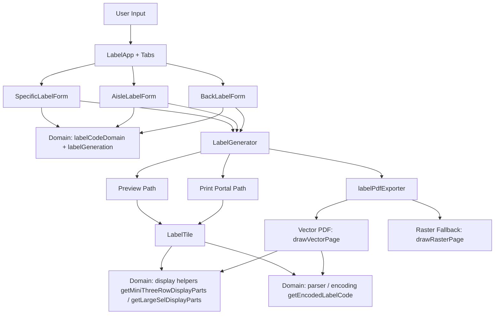

# SEL Generator

Generate Shelf Edge Labels for printing.

## Features

### Label Generation

The app provides three workflows for generating shelf edge labels:

- **Specific Labels**: Enter custom barcode values (one per line, comma-separated) in compact format (for example `01L01A`, `BR10L01A`, `BAK01A`). Spaces and dashes are not accepted.
- **Aisle Labels**: Generate sequential labels for store aisles, with configurable layout (mini or large SEL format).
- **Short Code  Labels**: Generate labels for back wall or front of store items, with custom prefix support.

### Generation Safety Limits

To prevent oversized jobs from degrading browser preview/export performance, generation uses a soft/hard cap:

- **Soft limit:** `500` labels — generation still succeeds and shows a warning.
- **Hard limit:** `1000` labels — generation is blocked with an error.

These are centrally configured in `src/config/labelConfig.ts` under:

- `LABEL_CONSTRAINTS.labelGeneration.softLimit`
- `LABEL_CONSTRAINTS.labelGeneration.hardLimit`

All labels display:

- A CODE128B barcode (always encoded compactly, without spaces or dashes, for reliable scanning)
- Encoded barcode value as readable text below the barcode for visual verification
- Primary text shown as side+bay (e.g., "R01")
- Secondary text shown with spaces in generated Aisle/Back flows

Shelf values are always alphabetical (`A`-`L`) across generated aisle and short code labels. Special aisle values are defined in code.

### Mini SEL Stacked Layout

Mini SEL labels use a stacked layout in preview, print, and vector PDF export:

- Row 1: aisle token or shortcode prefix and aisle token or Special aisle
- Row 2: side + bay or just bay (shortcode)
- Row 3: shelf token

Barcode payload encoding remains unchanged and always uses compact values.

### Print & Export

- **Print**: Render labels directly to your printer using browser print functionality, optimized for A4 SEL paper
- **Download**: Export labels as a PDF with vector graphics and scan-safe barcode encoding

### PDF Font Compatibility

- The vector PDF export path uses jsPDF built-in **Helvetica** for label text.
- This is intentional for broad cross-platform support (Windows/macOS/Linux) without requiring system fonts.
- **Do not** switch to non-built-in font names (for example Calibri) unless the font is explicitly embedded/registered in jsPDF.

## Architecture Overview

## Domain Model

The domain layer is split across three files:

- **`labelCodeParser.ts`**: Parses compact input into a `ParsedLabelCode` discriminated union with three branches: `{ kind: 'special'; parts: ISpecialCodeParts }`, `{ kind: 'aisle'; parts: IAisleCodeParts }`, and `{ kind: 'short'; parts: IShortCodeParts }`.
- **`labelCodeDisplay.ts`**: Converts parsed codes to display and encoding formats. `getEncodedLabelCode()` returns a `CompactLabelCode` branded type guaranteeing separator-free barcode payloads.
- **`labelCodeValidator.ts`**: Validates specific label codes against configured bounds.

Both `IAisleCodeParts` and `IShortCodeParts` extend a common `IBaseCodeParts` base (`bay`, `shelf`).

## Layout Strategies

Label layout is controlled by objects implementing `ILabelLayoutStrategy`. Each strategy declares two discriminants:

- **`mode`** (`LabelPrintMode`): `'mini-sel'` or `'large-sel'` — maps to the physical paper format.
- **`tileLayout`** (`TileLayout`): `'mini-stacked'` or `'large-heading'` — controls which rendering path is used in `LabelTile` and `drawVectorPage`.

Strategies are registered in a `Map<LabelPrintMode, ILabelLayoutStrategy>` inside `labelLayoutStrategies.ts`. Adding a new mini-sel variant requires:

1. A new strategy class implementing `ILabelLayoutStrategy` with a new `tileLayout` value (e.g. `'mini-two-row'`).
2. Adding the new `TileLayout` literal to `src/models/ILabelLayoutStrategy.ts`.
3. Adding a dispatch branch in `LabelTile.tsx` and `LabelPdfExport.ts` for the new `tileLayout`.
4. Adding geometry functions in `labelLayoutGeometry.ts` for the new row structure.
5. Registering the strategy in the `strategyByMode` map in `labelLayoutStrategies.ts`.

All geometry values must remain in millimeters.

## Build and Publish

### Local setup

1. Install dependencies:
   `npm install`
2. Start the development server:
   `npm run dev`

`npm install` also installs the repository's Git hooks, including a `pre-push` hook that runs `npm run validate:ci`.

### Production build

Generate a production-ready build with:

`npm run build`

The compiled output is written to `dist`.

### Publish

To publish this app, deploy the contents of `dist` using your preferred static hosting provider or web server. Currently the app uses Github Pages.

Before publishing, validate the build locally if needed with:

`npm run preview`

### Publish on GitHub Pages

This repository includes a GitHub Actions workflow that runs quality checks on pull requests to `main` and on pushes to `main`.

Quality checks run in CI:

- `npm run audit:prod`
- `npm run styles:types:check`
- `npm run styles:audit`
- `npm run test:run`
- `npm run test:a11y`
- `npm run build`

Run the same fast gate locally with:

`npm run validate:ci`

Run the consolidated release gate (matches deploy confidence) with:

`npm run validate:release`

This includes a production dependency audit (`npm run audit:prod`) and fails on high or critical vulnerabilities.

Deployment to GitHub Pages runs only after those checks pass, and only for pushes to `main`.

1. Push your latest changes to `main`.
2. In GitHub, open Settings > Pages (already enabled).
3. Set Source to GitHub Actions (already enabled).
4. Wait for the `Deploy to GitHub Pages` workflow to finish.

The site will be available at [https://tonygorman.github.io/sel-generator/](https://tonygorman.github.io/sel-generator/)

## Testing

### Style Safety

Generate typed CSS module declarations:

`npm run styles:types`

Check typed CSS module declarations are up to date:

`npm run styles:types:check`

Audit CSS/SCSS module classes for unused declarations and missing references:

`npm run styles:audit`

### Unit tests

Run all unit tests:

`npm run test:run`

This now includes a TypeScript import/typecheck pass before Vitest runs.

Run the same combined checks used by GitHub Actions (without E2E):

`npm run validate:ci`

Run full release-grade validation (includes E2E):

`npm run validate:release`

Run dependency audit only:

`npm run audit:prod`

### Accessibility tests

Run accessibility checks (axe) against key views:

`npm run test:a11y`

This is required by the release validation gate (`npm run validate:release`) and must pass before release is considered complete.

### Git hooks

This repo configures Git to use [.githooks/pre-push](/.githooks/pre-push), installed automatically by `npm install` via the `prepare` script.

The pre-push hook is branch-aware:

- **Pushing to `main`**: runs `npm run validate:release` (includes E2E).
- **Pushing to other branches**: runs `npm run validate:ci` (fast validation without E2E).

This ensures deploy-branch pushes have full confidence while keeping feature-branch iteration fast.

### Coverage

Run unit tests with coverage output:

`npm run test:coverage`

### End-to-end tests

Run all Playwright E2E tests:

`npm run test:e2e`

Run only the label regression spec:

`npm run test:e2e -- tests/e2e/label-regressions.spec.ts`

### Visual regression snapshots

Visual snapshots are part of the Playwright suite and are validated automatically when running `npm run test:e2e`.

The label regression spec now validates visual outputs for both label sizes:

- On-screen preview image snapshots for Mini SEL (35-label full page) and Large SEL (8-label full page)
- Downloaded PDF first-page visual snapshots for both Mini SEL and Large SEL
- PDF contract snapshots (page count, page dimensions, and orientation) for both label sizes

If UI changes are intentional, update the snapshot baselines with:

`npm run test:visual:update`

Snapshot files are stored under:

`tests/e2e/label-regressions.spec.ts-snapshots`

The label regression suite includes a dedicated visual snapshot baseline for the default Mini SEL stacked layout aisle preview.

## Barcode Format

The barcode payload is always stored and encoded in **compact format (no dashes or spaces)**, regardless of how users input or display the label code.

### Input Format Normalization

Specific Labels accepts compact input only (no spaces/dashes). Parsed valid inputs are encoded/scanned in compact form:

| Input Format | Barcode Payload | Barcode Output (Encoded/Scanned Value) | Display (Specific Labels) | Display (Aisle / Short code Labels) |
| --- | --- | --- | --- | --- |
| Compact numeric aisle | `01L01A` | `01L01A` (always compact, no separators) | `01L01A` | `01 L01 A` |
| Compact prefixed aisle | `BR10L01A` | `BR10L01A` (always compact, no separators) | `BR10L01A` | `BR10 L01 A` |
| Compact short code | `BAK01A` | `BAK01A` (always compact, no separators) | `BAK01A` | `BAK 01 A` |

### Display Impact

Display separators are presentational and do not affect barcode payload:

- **Specific Labels** accepts compact input only; secondary display stays compact.
- **Aisle Labels** and **Short Code Labels** generate codes programmatically; secondary display always uses spaces.
- Barcode in every case is always `01L01A`-style compact payload.

Named aisle values are validated against the configured explicit allow-list (default: `KIOSK`, `FLORAL`, `SEASONAL`) rather than inferred from generic alphabetic input.
Configured compact prefixed aisle inputs are validated against the configured aisle-prefix allow-list (default: `BR`, `BL`, `FL`, `FR`) and aisle numeric min/max bounds.

### Why Compact Encoding

Scanner reliability requires consistent, separator-free barcode payloads. The compact format ensures all scans decode to the same canonical form regardless of user input style.

## Label Sizes

The app supports two label sizes, selectable per print run.

### Mini SEL (default)

- Paper: A4 landscape, 39mm × 39mm labels
- Layout: 7 columns × 5 rows (35 labels per page)
- Available on: Aisle Labels, Short code Labels, and Specific Labels tabs

### Large SEL

- Paper: A4 portrait, 105mm × 73mm labels
- Layout: 2 columns × 4 rows (8 labels per page)
- Available on: Aisle Labels tab only
- Select using the **Mini SEL / Large SEL** radio buttons on the Aisle tab
- Label content: mixed-size heading (aisle-side+bay-shelf) above a centred barcode

## Print and Scan Validation Protocol

Use this protocol whenever PDF/export logic, barcode sizing, typography, or print styles are changed.

### Goal

Confirm generated labels remain machine-readable after:

- Browser preview
- PDF download
- Physical print

### Validation Inputs

Create at least one sample sheet from each flow:

- Aisle flow: low, mid, high values (for example 01, 50, 99) and multiple side ranges
- Short code flow: bay range and shelf range coverage
- Specific flow: compact numeric aisle, compact prefixed aisle (for example BR10L01A), short code, and named aisle values

Include shelf coverage:

- alphabetical shelves only (`A`-`L`)

### Printer and Media Matrix

Run scans for each available combination:

- Printer type: thermal, laser, inkjet (as available)
- Scale: 100 percent only (no fit-to-page)
- Media: production label stock and plain office paper

### Scanner Matrix

Test with at least one scanner from each class available in store/ops:

- Fixed POS scanner
- Handheld laser scanner
- Handheld camera/imager scanner

### Pass/Fail Criteria

For every printed sample:

- First-attempt scan rate should be 100 percent in normal operator use
- No manual keying required
- No repeated rescans for the same label under normal lighting
- Human-readable text must match the scanned value

### Failure Triage Checklist

If scan quality drops:

- Confirm print dialog used 100 percent scale
- Compare on-screen preview vs downloaded PDF vs printed output
- Re-test PDF export and print path independently
- Verify barcode module width and quiet-zone spacing were not reduced
- Verify no additional PDF/image compression was introduced

### Regression Gate

Treat scan validation as a release gate for barcode-related changes. A change is not complete until:

- automated tests pass
- print-and-scan matrix pass is recorded by the validating owner
