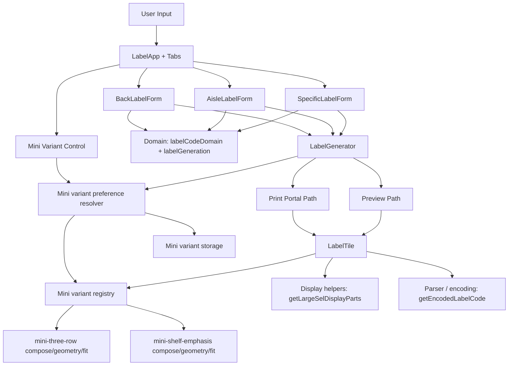

# SEL Generator

Generate Shelf Edge Labels for printing.

## Features

### Label Generation

The app provides three workflows for generating shelf edge labels:

- **Specific Labels**: Enter custom barcode values (one per line, comma-separated) in compact format (for example `01L01A`, `BR10L01A`, `BAK01A`). Spaces and dashes are not accepted.
- **Aisle Labels**: Generate sequential labels for store aisles, with configurable layout (mini or large SEL format).
- **Short Code  Labels**: Generate labels for back wall or front of store items, with custom prefix support.

### Generation Safety Limits

To prevent oversized jobs from degrading browser preview/export performance, generation uses a soft/hard cap:

- **Soft limit:** `1000` labels — generation still succeeds and shows a warning.
- **Hard limit:** `2000` labels — generation is blocked with an error.

These are centrally configured in `src/config/labelConfig.ts` under:

- `LABEL_CONSTRAINTS.labelGeneration.softLimit`
- `LABEL_CONSTRAINTS.labelGeneration.hardLimit`

All labels display:

- Aisle, side, bay, shelf values in several different variations as disccused next.
- A CODE128B barcode (always encoded compactly, without spaces or dashes, for reliable scanning)
- Encoded barcode value as readable text below the barcode for visual verification

Shelf values are always alphabetical (`A`-`Z`) across generated aisle and short code labels. Special aisle values are defined in code.

### Mini SEL Composition Variants

Mini SEL supports two composition variants that share the same 39mm x 39mm geometry and barcode placement:

- `mini-three-row` (default):
  - Row 1: aisle token or shortcode prefix
  - Row 2: side + bay or bay (shortcode)
  - Row 3: shelf token
- `mini-shelf-emphasis`:
  - Row 1: enlarged shelf token
  - Row 2: full spaced value (for example `01 L01 A`)

Variant selection is available in-app via the Mini Variant control.

Barcode payload encoding remains unchanged and always uses compact values.

### Print

- **Print**: Render labels directly to your printer using browser print functionality, optimized for A4 SEL paper

## Architecture Overview

## Domain Model

The domain layer is split across three files:

- **`labelCodeParser.ts`**: Parses compact input into a `ParsedLabelCode` discriminated union with three branches: `{ kind: 'special'; parts: ISpecialCodeParts }`, `{ kind: 'aisle'; parts: IAisleCodeParts }`, and `{ kind: 'short'; parts: IShortCodeParts }`.
- **`labelCodeDisplay.ts`**: Converts parsed codes to display and encoding formats. `getEncodedLabelCode()` returns a `CompactLabelCode` branded type guaranteeing separator-free barcode payloads.
- **`labelCodeValidator.ts`**: Validates specific label codes against configured bounds.

Both `IAisleCodeParts` and `IShortCodeParts` extend a common `IBaseCodeParts` base (`bay`, `shelf`).

## Layout Strategies

Label layout is controlled by objects implementing `ILabelLayoutStrategy`. Each strategy declares two discriminants:

- **`mode`** (`LabelPrintMode`): `'mini-sel'` or `'large-sel'` - maps to the physical paper format.
- **`tileLayout`** (`TileLayout`): `'mini-stacked'` or `'large-heading'` - controls large-vs-mini render path dispatch.

Strategies remain registered in a `Map<LabelPrintMode, ILabelLayoutStrategy>` inside `labelLayoutStrategies.ts`.

Mini text arrangement is now handled by mini composition variants in `src/domain/miniCompositionVariants.ts`, not by adding new `TileLayout` values.

Mini variant selection order:

1. In-app Mini Variant selection (persisted to local storage).
2. Fallback default: `mini-three-row`.

To add a new mini variant:

1. Add a new `MiniCompositionVariantId` literal in `src/models/IMiniCompositionVariant.ts`.
2. Implement `composeLabel`, `resolveGeometry`, and `fitTypography` in `src/domain/miniCompositionVariants.ts`.
3. Register the variant in the registry map in `src/domain/miniCompositionVariants.ts`.
4. Add/update tests for `LabelTile` and domain variant behavior.

All geometry values must remain in millimeters.

## Build and Publish

### Local setup

1. Install dependencies:
   `npm install`
2. Start the development server:
   `npm run dev`

`npm install` also installs the repository's Git hooks, including a branch-aware `pre-push` hook:

- pushes to `main` run `npm run validate:release`
- pushes to other branches run `npm run validate:ci`

### Production build

Generate a production-ready build with:

`npm run build`

The compiled output is written to `dist`.

### Publish

To publish this app, deploy the contents of `dist` using your preferred static hosting provider or web server. Currently the app uses Github Pages.

Before publishing, validate the build locally if needed with:

`npm run preview`

### Publish on GitHub Pages

This repository includes a GitHub Actions workflow that runs quality checks on pull requests to `main` and on pushes to `main`.

Quality checks run in CI:

- `npm run audit:prod`
- `npm run styles:types:check`
- `npm run styles:audit`
- `npm run test:run`
- `npm run build`

Run the fast local validation gate with:

`npm run validate:ci`

This runs:

- `npm run styles:types:check`
- `npm run styles:audit`
- `npm run test:run` (typecheck + unit tests)
- `npm run build:bundle`

The GitHub Pages deploy workflow uses a slightly stricter quality gate: the same checks as `validate:ci`, plus `npm run audit:prod`.

Run the full release validation gate with:

`npm run validate:release`

This runs:

- `npm run validate:ci`
- `npm run audit:prod`
- `npm run test:a11y`
- `npm run test:e2e`

It fails on high or critical production vulnerabilities. These are the same branch-aware pre-push checks described above: pushes to `main` run `npm run validate:release`, and pushes to other branches run `npm run validate:ci`.

Deployment to GitHub Pages runs only after those checks pass, and for pushes to `main`. Workflow_dispatch can also be used to manually push a branch.

1. Push your latest changes to `main`.
2. In GitHub, open Settings > Pages (already enabled).
3. Set Source to GitHub Actions (already enabled).
4. Wait for the `Deploy to GitHub Pages` workflow to finish.

The site will be available at [https://tonygorman.github.io/sel-generator/](https://tonygorman.github.io/sel-generator/)

## Testing

## Skills Check Invocation

For code reviews in Copilot Chat, explicitly request the `react-best-practices` skill and include scope, validation commands, and expected output format.

Use this template:

1. Skill: `react-best-practices`
2. Scope: files/folders to review
3. Evidence: commands to run (`npm run validate:ci` or `npm run validate:release`)
4. Output: findings first, ordered by severity, with file references

Example prompts:

- `Run a react-best-practices skills check on src/components and src/domain, then run npm run validate:ci. Return findings by severity with file links.`
- `Use react-best-practices for a full repo review and include release evidence from npm run validate:release.`
- `Skills check only for changed files in this branch using react-best-practices, with accessibility and print-path risks prioritized.`

Shortcut prompt:

- `Do a react-best-practices skills check, full repo, include validate:release, findings first.`

### Style Safety

Generate typed CSS module declarations:

`npm run styles:types`

Check typed CSS module declarations are up to date:

`npm run styles:types:check`

Audit CSS/SCSS module classes for unused declarations and missing references:

`npm run styles:audit`

### Unit tests

Run all unit tests:

`npm run test:run`

This now includes a TypeScript import/typecheck pass before Vitest runs.

Run the fast local validation gate:

`npm run validate:ci`

Run full release validation (adds dependency audit, accessibility, and E2E checks):

`npm run validate:release`

Run dependency audit only:

`npm run audit:prod`

### Accessibility tests

Run accessibility checks (axe) against key views:

`npm run test:a11y`

This is required by the release validation gate (`npm run validate:release`) and must pass before release is considered complete.

### Git hooks

This repo configures Git to use [.githooks/pre-push](/.githooks/pre-push), installed automatically by `npm install` via the `prepare` script.

The pre-push hook is branch-aware:

- **Pushing to `main`**: runs `npm run validate:release` (includes E2E).
- **Pushing to other branches**: runs `npm run validate:ci` (fast validation without E2E).

This ensures deploy-branch pushes have full confidence while keeping feature-branch iteration fast.

### Coverage

Run unit tests with coverage output:

`npm run test:coverage`

### End-to-end tests

Run all Playwright E2E tests:

`npm run test:e2e`

Run only the label regression spec:

`npm run test:e2e -- tests/e2e/label-regressions.spec.ts`

### Visual regression snapshots

Visual snapshots are part of the Playwright suite and are validated automatically when running `npm run test:e2e`.

The label regression spec now validates visual outputs for both label sizes:

- On-screen preview image snapshots for Mini SEL (35-label full page) and Large SEL (8-label full page)

If UI changes are intentional, update the snapshot baselines with:

`npm run test:visual:update`

Snapshot files are stored under:

`tests/e2e/label-regressions.spec.ts-snapshots`

The label regression suite includes a dedicated visual snapshot baseline for the default Mini SEL stacked layout aisle preview.

## Barcode Format

The barcode payload is always stored and encoded in **compact format (no dashes or spaces)**, regardless of how users input or display the label code.

### Input Format Normalization

Specific Labels accepts compact input only (no spaces/dashes). Parsed valid inputs are encoded/scanned in compact form:

| Input Format | Barcode Payload | Barcode Output (Encoded/Scanned Value) | Display (Specific Labels) | Display (Aisle / Short code Labels) |
| --- | --- | --- | --- | --- |
| Compact numeric aisle | `01L01A` | `01L01A` (always compact, no separators) | `01L01A` | `01 L01 A` |
| Compact prefixed aisle | `BR10L01A` | `BR10L01A` (always compact, no separators) | `BR10L01A` | `BR10 L01 A` |
| Compact short code | `BAK01A` | `BAK01A` (always compact, no separators) | `BAK01A` | `BAK 01 A` |

### Display Impact

Display separators are presentational and do not affect barcode payload:

- **Specific Labels** accepts compact input only; secondary display stays compact.
- **Aisle Labels** and **Short Code Labels** generate codes programmatically; secondary display always uses spaces.
- Barcode in every case is always `01L01A`-style compact payload.

Named aisle values are validated against the configured explicit allow-list (default: `KIOSK`, `FLORAL`, `SEASONAL`) rather than inferred from generic alphabetic input.
Configured compact prefixed aisle inputs are validated against the configured aisle-prefix allow-list (default: `BR`, `BL`, `FL`, `FR`) and aisle numeric min/max bounds.

### Why Compact Encoding

Scanner reliability requires consistent, separator-free barcode payloads. The compact format ensures all scans decode to the same canonical form regardless of user input style.

## Label Sizes

The app supports two label sizes, selectable per print run.

### Mini SEL (default)

- Paper: A4 landscape, 39mm × 39mm labels
- Layout: 7 columns × 5 rows (35 labels per page)
- Available on: Aisle Labels, Short code Labels, and Specific Labels tabs

### Large SEL

- Paper: A4 portrait, 105mm × 73mm labels
- Layout: 2 columns × 4 rows (8 labels per page)
- Available on: Aisle Labels tab only
- Select using the **Mini SEL / Large SEL** radio buttons on the Aisle tab
- Label content: mixed-size heading (aisle-side+bay-shelf) above a centred barcode

## Print and Scan Validation Protocol

Use this protocol whenever barcode sizing, typography, or print styles are changed.

### Goal

Confirm generated labels remain machine-readable after:

- Browser preview
- Physical print

### Validation Inputs

Create at least one sample sheet from each flow:

- Aisle flow: low, mid, high values (for example 01, 50, 99) and multiple side ranges
- Short code flow: bay range and shelf range coverage
- Specific flow: compact numeric aisle, compact prefixed aisle (for example BR10L01A), short code, and named aisle values

Include shelf coverage:

- alphabetical shelves only (`A`-`Z`)

### Printer and Media Matrix

Run scans for each available combination:

- Printer type: thermal, laser, inkjet (as available)
- Scale: 100 percent only (no fit-to-page)
- Media: production label stock and plain office paper

### Scanner Matrix

Test with at least one scanner from each class available in store/ops:

- Fixed POS scanner
- Handheld laser scanner
- Handheld camera/imager scanner

### Pass/Fail Criteria

For every printed sample:

- First-attempt scan rate should be 100 percent in normal operator use
- No manual keying required
- No repeated rescans for the same label under normal lighting
- Human-readable text must match the scanned value

### Failure Triage Checklist

If scan quality drops:

- Confirm print dialog used 100 percent scale
- Compare on-screen preview vs printed output
- Verify barcode module width and quiet-zone spacing were not reduced

### Regression Gate

Treat scan validation as a release gate for barcode-related changes. A change is not complete until:

- automated tests pass
- print-and-scan matrix pass is recorded by the validating owner
