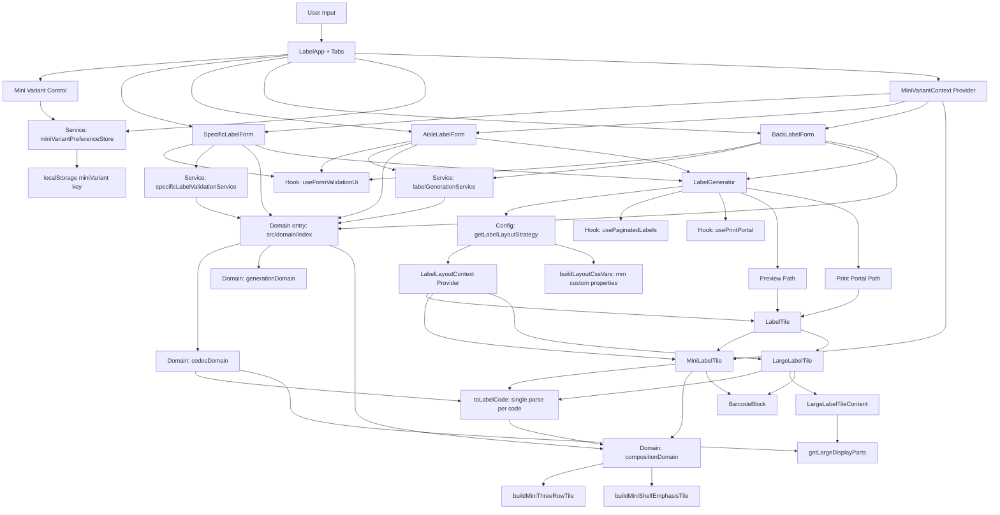

# SEL Generator

Generate Shelf Edge Labels for printing mini labels (39mm × 39mm) and large labels (105mm × 73mm) onto special perforated paper. Each size has its own particular paper to space the labels correctly.

There are 2 supported variations of mini labels reflecting differing use cases: "three-row" and "shelf emphasis".

## Label Examples

| Mini three-row                                                                      | Mini shelf-emphasis                                                                       | Large SEL                                                             |
| ----------------------------------------------------------------------------------- | ----------------------------------------------------------------------------------------- | --------------------------------------------------------------------- |
|  |  |  |

## Features

### Label Generation

The app provides three workflows for generating shelf edge labels:

- **Specific Labels**: Manually enter label values, comma-separated, in compact format (for example `01L01A`, `BR10L01A`, `BAK01A`). Spaces and dashes are not accepted. Supports both mini & large labels.
- **Aisle Labels**: Generate sequential labels for store aisles, with configurable layout (mini or large SEL format) and optional shelf range selection (e.g., shelves B through D instead of always A through chosen value).
- **Short Code Labels**: Generate labels for back wall or front of store items, with custom prefix support.

All labels display:

- Aisle, side, bay, shelf values in several different variations as discussed next.
- A CODE128B barcode (always encoded compactly, without spaces or dashes, for reliable scanning)
- Encoded barcode value as readable text below the barcode for visual verification

Shelf values are always alphabetical (`A`-`Z`) across all label types.
`Special aisle` values are defined in code via a config entry for values such as `KIOSK` or `FLORAL`. These only display that special aisle value, without side, bay or shelf and as such are "special".

### Mini SEL Variations

Mini SEL supports two variations that share the same 39mm x 39mm geometry and barcode placement:

- `mini-three-row` (default):
  - Row 1: aisle token or shortcode prefix
  - Row 2: side + bay or bay (shortcode)
  - Row 3: shelf token
- `mini-shelf-emphasis`:
  - Row 1: enlarged shelf token
  - Row 2: full spaced value (for example `01 L01 A`)

Variant selection is available in-app via the Mini Variant control.

In all SEL types and sizes the barcode is at the bottom.
Barcode payload encoding always uses compact values.

### Print

- **Print**: Render labels directly to your printer using browser print functionality, optimized for A4 SEL paper. You can 'print to PDF' if you want to download and print later.

## Barcode Format

The barcode payload is always stored and encoded in **compact format (no dashes or spaces)**, regardless of how users input or display the label code.

### Input Format Normalization

Specific Labels accepts compact input only (no spaces/dashes). Parsed valid inputs are encoded/scanned in compact form. The readable display is laid out differently depending on the label type chosen:

| Input format           | Barcode payload (all layouts)              | Readable display |
| ---------------------- | ------------------------------------------ | ---------------- |
| Compact numeric aisle  | `01L01A` (always compact, no separators)   | `01 L01 A`       |
| Compact prefixed aisle | `BR10L01A` (always compact, no separators) | `BR10 L01 A`     |
| Compact short code     | `BAK01A` (always compact, no separators)   | `BAK 01 A`       |

For Mini SEL, the three-row variant places those parts on separate rows, while the shelf-emphasis variant enlarges the shelf part and shows the full spaced value beneath it. Large SEL uses the same parts in a mixed-size heading.

### Display Impact

- **Specific Labels** accepts compact input only; its readable display uses the selected layout's formatting.
- **Aisle Labels** and **Short Code Labels** generate the same compact payloads programmatically; their readable display uses the selected layout's formatting.
- Barcode in every case is always `01L01A`-style compact payload.

Named aisle values are validated against the configured explicit allow-list (default: `KIOSK`, `FLORAL`) rather than inferred.
Configured compact prefixed aisle inputs are validated against the configured aisle-prefix allow-list (default: `BR`, `BL`, `FL`, `FR`, `PD`) and aisle numeric min/max bounds. These default prefixes represent store sections: `BR` = Back Right, `BL` = Back Left, `FL` = Front Left, `FR` = Front Right, `PD` = Produce.

### Why Compact Encoding

Scanner reliability requires consistent, separator-free barcode payloads. The compact format ensures all scans decode to the same canonical form regardless of user input style.

## Compact Code Validation Rules

Validation of compact codes follows a two-phase process: **shape recognition** (what kind of code is it?) followed by **token range checks** (are the tokens within bounds?). This section documents the complete rule set.

### Phase 1: Shape Recognition

Input is trimmed and uppercased first. Patterns are matched in order; the first match determines the code kind. Patterns with alternations (like aisle prefixes) are sorted longest-first to prevent shadowing.

| #   | Kind               | Pattern                                                     | Example               | Failure       |
| --- | ------------------ | ----------------------------------------------------------- | --------------------- | ------------- |
| 0   | —                  | Reject if code contains `-` or space                        | `01-L-01A`            | `not-compact` |
| 1   | `special`          | Exact match: `FLORAL` \| `KIOSK`                            | `KIOSK`               | —             |
| 2   | `aisle` (prefixed) | `^(BR\|BL\|FL\|FR\|PD)(\d{1,2})(L\|R\|E\|F)(\d{2})([A-Z])$` | `BR7L01A`, `PD12R05C` | `unparseable` |
| 3   | `aisle` (numeric)  | `^(\d{2})(L\|R\|E\|F)(\d{2})([A-Z])$`                       | `01L01A`              | `unparseable` |
| 4   | `short`            | `^(BAK\|FOS\|FNT)(\d{2})([A-Z])$`                           | `BAK01A`              | `unparseable` |
| 5   | —                  | No match                                                    | `ZZZ`                 | `unparseable` |

**Note:** Numeric aisle form requires **exactly two** digits (`01L01A`), but prefixed form allows **one or two** (`BR7L01A` or `BR07L01A` both parse).

### Phase 2: Token Validation

Once a shape is recognized, tokens are validated in order (first failure is reported). Range checks apply only to matched shapes.

#### By Token

| Token        | Applies to                  | Rule                                        | Bounds                                 | Source                            | Failure                |
| ------------ | --------------------------- | ------------------------------------------- | -------------------------------------- | --------------------------------- | ---------------------- |
| aisle number | `aisle` only                | integer, no leading zeros                   | `0–99`                                 | `minAisleValue` / `maxAisleValue` | `invalid-aisle-range`  |
| aisle prefix | `aisle` (non-numeric token) | must be in configured aisle prefixes        | `BR`, `BL`, `FL`, `FR`, `PD` (default) | `aislePrefixes` option            | `invalid-aisle-prefix` |
| bay          | `aisle`, `short`            | integer, leading zeros allowed              | `01–99` (note: `00` fails)             | `maxBayValue`, min hardcoded 1    | `invalid-bay-range`    |
| shelf        | `aisle`, `short`            | single uppercase letter, `≤ maxShelfLetter` | `A–Z` (default)                        | `maxShelfLetter`                  | `invalid-shelf-range`  |
| —            | `special`                   | no range checks                             | —                                      | —                                 | —                      |

#### By Code Kind (Check Order)

| Kind      | Checks (in order)          | Notes                                        |
| --------- | -------------------------- | -------------------------------------------- |
| `special` | (none)                     | Always valid if it matches the shape         |
| `aisle`   | prefix/range → bay → shelf | Prefix checked first if token is non-numeric |
| `short`   | bay → shelf                | No prefix validation (already matched)       |

### Validation Error Reasons

Typed error codes returned by `validateSpecificLabelCode` in `src/domain/codesDomain.ts`:

| Error Reason           | Meaning                                       | Example                              |
| ---------------------- | --------------------------------------------- | ------------------------------------ |
| `not-compact`          | Input contains spaces or dashes               | `01-L-01A`, `01 L 01 A`              |
| `unparseable`          | No pattern matched the input                  | `xyz`, `1L01A` (too short)           |
| `invalid-aisle-prefix` | Aisle prefix not in configured allow-list     | `XX1L01A` (if only BR/BL configured) |
| `invalid-aisle-range`  | Aisle number outside bounds                   | `BR100L01A` (if max is 99)           |
| `invalid-bay-range`    | Bay number outside bounds or zero             | `01L00A`, `01L100A`                  |
| `invalid-shelf-range`  | Shelf letter beyond configured max or invalid | `01L01Z` (if max is X)               |

### Maintenance Note

Validation rules are defined data-driven in `VALIDATION_SPECS` in `src/domain/codesDomain.ts`. To modify:

1. **Add a new check**: Add a `ValidationStep` to the appropriate kind in `VALIDATION_SPECS`.
2. **Change bounds**: Update constants in `src/config/labelConfig.ts` and rerun tests.
3. **Change error message**: Update the message in `SPECIFIC_LABEL_REASON_MESSAGES` in `src/config/validationMessages.ts`.

## Label Sizes

The app supports two label sizes, selectable per print run.

### Mini SEL (default)

- Paper: A4 landscape, 39mm × 39mm labels
- Layout: 7 columns × 5 rows (35 labels per page)
- Available on: Aisle Labels, Short code Labels, and Specific Labels tabs

### Large SEL

- Paper: A4 portrait, 105mm × 73mm labels
- Layout: 2 columns × 4 rows (8 labels per page)
- Available on: Aisle Labels and Specific Labels tabs
- Select using the **Mini SEL / Large SEL** radio buttons
- Label content: mixed-size heading (aisle-side+bay-shelf) above a centred barcode
- **Limitation**: Special aisle values (e.g. `KIOSK`, `FLORAL`) are not supported on large labels; use mini labels for special values. This is intentional to avoid complexity in large labels, in the absence of any actual user requirement.

## Architecture Overview


```mermaid
flowchart TD
  U[User Input] --> A[LabelApp + Tabs]
  A --> MVU[Mini Variant Control]
  A --> SF[SpecificLabelForm]
  A --> AF[AisleLabelForm]
  A --> BF[BackLabelForm]

  A --> MPS[Service: miniVariantPreferenceStore]
  MPS --> ST[localStorage miniVariant key]
  A --> MVC[MiniVariantContext Provider]
  MVU --> MPS

  SF --> HUI[Hook: useFormValidationUi]
  AF --> HUI
  BF --> HUI

  SF --> SVS[Service: specificLabelValidationService]
  AF --> LGS[Service: labelGenerationService]
  BF --> LGS

  SF --> DI[Domain entry: src/domain/index]
  AF --> DI
  BF --> DI
  SVS --> DI
  LGS --> DI

  DI --> CD[Domain: codesDomain]
  DI --> GD[Domain: generationDomain]
  DI --> CMP[Domain: compositionDomain]

  MVC --> SF
  MVC --> AF
  MVC --> BF

  SF --> LG[LabelGenerator]
  AF --> LG
  BF --> LG

  LG --> LS[Config: getLabelLayoutStrategy]
  LS --> LLX[LabelLayoutContext Provider]
  LS --> CSSV[buildLayoutCssVars: mm custom properties]
  LG --> UP[Hook: usePaginatedLabels]
  LG --> UPP[Hook: usePrintPortal]
  LG --> PL[Preview Path]
  LG --> PR[Print Portal Path]

  PL --> LT[LabelTile]
  PR --> LT
  LLX --> LT

  LT --> MLT[MiniLabelTile]
  LT --> LLT[LargeLabelTile]
  LLX --> MLT
  LLX --> LLT

  MVC --> MLT
  CD --> TLC[toLabelCode: single parse per code]
  MLT --> TLC
  LLT --> TLC
  TLC --> CMP
  MLT --> CMP
  CMP --> M3[buildMiniThreeRowTile]
  CMP --> MS[buildMiniShelfEmphasisTile]

  LLT --> LLC[LargeLabelTileContent]
  LLT --> BBC[BarcodeBlock]
  CD --> DH[getLargeDisplayParts]
  LLC --> DH
  MLT --> BBC
```

Two paths in that diagram are easy to miss:

- **Geometry reaches tiles via context, not the domain.** `LabelGenerator` resolves the
  layout strategy for the active mode, provides it through `LabelLayoutContext`, and emits
  the mm values as CSS custom properties. Every tile reads its millimetre spec from that
  context.
- **Mini variant reaches the forms too, not just the tile.** All three forms consume
  `MiniVariantContext` so they can clear generated output when the variant changes.

## Domain Model

The diagram above shows module wiring. For the **data-shape pipeline** — what type a label
is at each hop from form input to barcode, plus the two non-obvious behaviours in that path
— see the `Domain Pipeline Map` and `Domain Glossary` sections in [AGENTS.md](AGENTS.md).
That map is maintained in one place; this README does not duplicate it.

The domain layer is intentionally consolidated into three modules:

- **`src/domain/codesDomain.ts`**: Compact code parsing, display-part conversion, barcode encoding helpers, and specific-label validation.
- **`src/domain/generationDomain.ts`**: Aisle/short generation rules, numeric parsing, and form-input validation for generated label workflows.
- **`src/domain/compositionDomain.ts`**: Mini composition variants, geometry derivation, and typography fit logic used by tile rendering.

Use **`src/domain/index.ts`** as the public domain entrypoint for imports.

### Parsing happens once per code

`toLabelCode(code)` parses a raw code a single time and returns a `LabelCode` carrying the
parsed tokens alongside every projection the render path needs (`miniDisplayParts`,
`compact` barcode payload, `spaced` display form). Tile components call it once and pass
the `LabelCode` down.

The string-taking helpers (`getEncodedLabelCode`, `getSpacedLabelCode`,
`getMiniThreeRowDisplayParts`, `getLargeSelDisplayParts`) remain as thin wrappers for
callers that only have a raw string. Do not use them inside a tile render path — that
reintroduces the redundant re-parsing they were extracted to remove.

## Layer Intent

- **`src/domain/*`**: Pure parsing, validation, generation, and formatting rules.
- **`src/services/*Service.ts`**: Application orchestration for label workflows (validation + generation).
- **`src/hooks/*`**: UI state and event orchestration for forms and preview/print behavior.
- **`src/components/*` (render components)**: Presentation and layout rendering only.

Naming convention:

- Use noun-oriented module names for orchestration modules (`*Service.ts`).
- Use verb-oriented exports (`generateAisleLabels`, `generateShortLabels`, `validateSpecificLabels`).
- `npm run lint:naming` enforces hook export/file naming as errors and reports boolean-prefix drift as warnings.
- Naming lint runs as part of `npm run validate:ci`.

## Layout Strategies

Label layout is controlled by a discriminated union of layout strategies in
`src/config/labelLayoutStrategies.ts` (`MiniLabelLayoutStrategy | LargeLabelLayoutStrategy`).
Each strategy declares two discriminants:

- **`mode`** (`LabelPrintMode`): `'mini-sel'` or `'large-sel'` - the physical paper format.
- **`tileSize`**: `'small'` or `'large'` - controls large-vs-mini render.

Typography is split so neither strategy declares fields it never reads: a shared core plus
mini-only autofit fields (`primaryTextMinSizeMm`, `primaryAutoFitEnabled`) and large-only
heading sizes (`largePrefixTextSizeMm`, `largeMainTextSizeMm`).

Mini text arrangement is handled in `src/domain/compositionDomain.ts`.

Mini variant selection order:

1. In-app Mini Variant selection (persisted to local storage).
2. Fallback default: `mini-three-row`.

To add a new mini variant:

1. Add the new id to the `MiniCompositionVariantId` union in `src/domain/compositionDomain.ts`.
2. Add a matching `{ id, label }` entry to `MINI_VARIANT_OPTIONS` (this drives both the
   selector options and `localStorage` validation).
3. Add a `Mini<Name>Tile` member to the `MiniTile` discriminated union with its own required
   line/geometry/weight fields, and a `buildMini<Name>Tile` function that returns it.
4. Dispatch to the new builder in `buildMiniTile`, and render its branch in
   `MiniLabelTile.tsx`'s switch on `tile.variantId`.
5. Add/update tests for `LabelTile` and domain variant behavior, then refresh visual
   baselines only if the change is intentional.

All geometry values _must_ remain in millimeters.

## Build and Publish

### Local setup

1. Install dependencies:
   `npm install`
2. Start the development server:
   `npm run dev`

When changing Node.js versions with `nvm`, select the project-supported Node 24 LTS release and reinstall the local dependencies and Playwright browser:

```sh
nvm use 24
npm install
npm run test:e2e:install
```

Run `npm run test:e2e:install` again after each Node.js version change before
running the Playwright E2E suite.

`npm install` also installs the repository's Git hooks, including a branch-aware `pre-push` hook:

- pushes to `main` run `npm run validate:release`
- pushes to other branches run `npm run validate:ci`

### Production build

Generate a production-ready build with:

`npm run build`

The compiled output is written to `dist`.

### Publish

To publish this app, deploy the contents of `dist` using your preferred static hosting provider or web server. Currently the app uses Github Pages.

Before publishing, validate the build locally if needed with:

`npm run preview`

### Publish on GitHub Pages

This repository includes a GitHub Actions workflow that runs quality checks on pull requests to `main` and on pushes to `main`.

Quality checks run in CI:

- `npm run audit:prod`
- `npm run styles:types:check`
- `npm run styles:audit`
- `npm run lint`
- `npm run lint:naming`
- `npm run lint:complexity`
- `npm run test:run`
- `npm run build`

Run the fast local validation gate with:

`npm run validate:ci`

This runs:

- `npm run styles:types:check`
- `npm run styles:audit`
- `npm run lint`
- `npm run lint:naming`
- `npm run lint:complexity`
- `npm run test:run` (typecheck + unit tests)
- `npm run build:bundle`

The GitHub Pages deploy workflow uses a slightly stricter quality gate: the same checks as `validate:ci`, plus `npm run audit:prod`.

Run the full release validation gate with:

`npm run validate:release`

This runs:

- `npm run validate:ci`
- `npm run audit:prod`
- `npm run test:a11y`
- `npm run test:e2e`

It fails on high or critical production vulnerabilities. These are the same branch-aware pre-push checks described above: pushes to `main` run `npm run validate:release`, and pushes to other branches run `npm run validate:ci`.

Deployment to GitHub Pages runs only after those checks pass, and for pushes to `main`. Workflow_dispatch can also be used to manually push a branch. The deploy job automatically retries once if GitHub Pages returns a transient post-upload failure.

1. Push your latest changes to `main`.
2. In GitHub, open Settings > Pages (already enabled).
3. Set Source to GitHub Actions (already enabled).
4. Wait for the `Deploy to GitHub Pages` workflow to finish.

The site will be available at [https://tonygorman.github.io/sel-generator/](https://tonygorman.github.io/sel-generator/)

## Testing

Skill selection quick guide:

- Use `react-best-practices` for React/render-path and print-geometry review.
- Use `code-review-quality` for testability, maintainability, and test-quality critique.

## Skills Check Invocation

For code reviews in Copilot Chat, explicitly request the `react-best-practices` skill and include scope, validation commands, and expected output format.

For test-quality and maintainability reviews, explicitly request the `code-review-quality` skill with the same structure.

Use this template:

1. Skill: `react-best-practices`
2. Scope: files/folders to review
3. Evidence: commands to run (`npm run validate:ci` or `npm run validate:release`)
4. Output: findings first, ordered by severity, with file references

Example prompts:

- `Run a react-best-practices skills check on src/components and src/domain, then run npm run validate:ci. Return findings by severity with file links.`
- `Use react-best-practices for a full repo review and include release evidence from npm run validate:release.`
- `Skills check only for changed files in this branch using react-best-practices, with accessibility and print-path risks prioritized.`

Shortcut prompt:

- `Do a react-best-practices skills check, full repo, include validate:release, findings first.`
- `Use code-review-quality to review tests in src/components and tests/e2e, include npm run validate:release, findings first with actionable fixes.`

### Style Safety

Generate typed CSS module declarations:

`npm run styles:types`

Check typed CSS module declarations are up to date:

`npm run styles:types:check`

Audit CSS/SCSS module classes for unused declarations and missing references:

`npm run styles:audit`

### Unit tests

Run all unit tests:

`npm run test:run`

This now includes a TypeScript import/typecheck pass before Vitest runs.

Run the fast local validation gate:

`npm run validate:ci`

Run full release validation (adds dependency audit, accessibility, and E2E checks):

`npm run validate:release`

Run dependency audit only:

`npm run audit:prod`

### Accessibility tests

Run accessibility checks (axe) against key views:

`npm run test:a11y`

This is required by the release validation gate (`npm run validate:release`) and must pass before release is considered complete.

### Git hooks

This repo configures Git to use [.githooks/pre-push](/.githooks/pre-push), installed automatically by `npm install` via the `prepare` script.

The pre-push hook is branch-aware:

- **Pushing to `main`**: runs `npm run validate:release` (includes E2E).
- **Pushing to other branches**: runs `npm run validate:ci` (fast validation without E2E).

This ensures deploy-branch pushes have full confidence while keeping feature-branch iteration fast.

### Coverage

Run unit tests with coverage output:

`npm run test:coverage`

### End-to-end tests

Run all Playwright E2E tests:

`npm run test:e2e`

If all E2E tests fail immediately at browser launch after dependency updates (for example missing Chromium executable), install browsers first:

`npm run test:e2e:install`

Run only one of the focused specs, e.g. the Aisle Labels flow:

`npm run test:e2e -- tests/e2e/aisle-flow.spec.ts`

The E2E suite is split into focused specs under `tests/e2e/`: `tabs-accessibility.spec.ts`, `specific-flow.spec.ts`, `aisle-flow.spec.ts`, `back-flow.spec.ts`, and `visual-baselines.spec.ts`.

### Visual regression snapshots

Visual snapshots are part of the Playwright suite and are validated automatically when running `npm run test:e2e`.

`tests/e2e/visual-baselines.spec.ts` validates visual outputs for both label sizes:

- On-screen preview image snapshots for Mini SEL (35-label full page and shelf-emphasis aisle preview) and Large SEL (8-label full page)

If UI changes are intentional, update the snapshot baselines with:

`npm run test:visual:update`

Snapshot files are stored under:

`tests/e2e/visual-baselines.spec.ts-snapshots`

## Print and Scan Validation Protocol

Use this protocol whenever barcode sizing, typography, or print styles are changed.

### Goal

Confirm generated labels remain machine-readable after:

- Browser preview
- Physical print

### Validation Inputs

Create at least one sample sheet from each flow:

- Aisle flow: low, mid, high values (for example 01, 50, 99) and multiple side ranges
- Short code flow: bay range and shelf range coverage
- Specific flow: compact numeric aisle, compact prefixed aisle (for example BR10L01A), short code, and named aisle values

Include shelf coverage:

- alphabetical shelves only (`A`-`Z`)

### Printer and Media Matrix

Run scans for each available combination:

- Printer type: thermal, laser, inkjet (as available)
- Scale: 100 percent only (no fit-to-page)
- Media: production label stock and plain office paper

### Scanner Matrix

Test with at least one scanner from each class available in store/ops:

- Fixed POS scanner
- Handheld laser scanner
- Handheld camera/imager scanner

### Pass/Fail Criteria

For every printed sample:

- First-attempt scan rate should be 100 percent in normal operator use
- No manual keying required
- No repeated rescans for the same label under normal lighting
- Human-readable text must match the scanned value

### Failure Triage Checklist

If scan quality drops:

- Confirm print dialog used 100 percent scale
- Compare on-screen preview vs printed output
- Verify barcode module width and quiet-zone spacing were not reduced

### Regression Gate

Treat scan validation as a release gate for barcode-related changes. A change is not complete until:

- automated tests pass
- print-and-scan matrix pass is recorded by the validating owner
